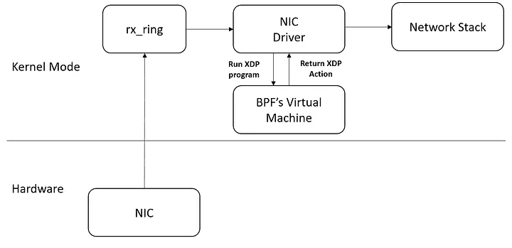

# eBPF and XDP

## Definitions

1. (eBPF) Express Barkley Packet Filter is an application that runs on kernel. eBPF is a technology in the Linux kernel that enables the dynamic insertion of custom programs (BPF programs) into various hooks throughout the kernel, allowing for efficient and flexible packet filtering, tracing, and other types of kernel-level processing.
XDP is based on eBPF (Extended Berkeley Packet Filter), which is a virtual machine that runs inside the Linux kernel (similar to the concepts of a JVM but with differences like executing inside the kernel). What you need to know for now about eBPF is that we can execute a user-defined program inside a sandbox in the kernel. As part of the instrumentation series I will deep dive into eBPF.

 Because there are some drawbacks in kernel bypass such as: eBPF programs are needed to write their own drivers and that they need implement any functionality without relaying on the kernel’s network stack there was a need for a framework which will reduce those kinds of headaches — that is XDP. You can see in the diagram below an illustration of one of the ways which we can use XDP.



2. (XDP) Express Data Path is a technology that allows developers to attach eBPF programs to low-level hooks. XDP is a framework that makes it possible to perform high-speed packet processing within BPF applications.

3. XDP is used by different applications such as: firewalls, DDoS mitigation, load balancing, network monitoring, high speed forwarding, flow sampling and more.

**Note By using XDP we can perform different operations on the received packets: drop packets (XDP_DROP), forward the packets to the normal network stack (XDP_PASS), forward the packets to the the same interface it received it from (XDP_TX) lastly bypass the normal stack and forward the packets to the network by a different NIC (XDP_REDIRECT).**

### XDP Models

1. **Generic XDP** – XDP programs are loaded into the kernel as part of the ordinary network path. This does not provide full performance benefits, but is an easy way to test XDP programs or run them on generic hardware that does not provide specific support for XDP.

2. **Native XDP** – The XDP program is loaded by the network card driver as part of its initial receive path. This also requires support from the network card driver.

3. **Offloaded XDP** – The XDP program loads directly on the NIC, and executes without using the CPU. This requires support from the network interface device.


### XDP Operations


1. **XDP_DROP** – Drops and does not process the packet. eBPF programs can analyze traffic patterns and use filters to update the XDP application in real time to drop specific types of packets (for example, malicious traffic).

2. **XDP_PASS** – Indicates that the packet should be forwarded to the normal network stack for further processing. The XDP program can modify the content of the package before this happens.

3. **XDP_TX** – Forwards the packet (which may have been modified) to the same network interface that received it.

4. **XDP_REDIRECT** – Bypasses the normal network stack and redirects the packet via another NIC to the network.


### XDP User Cases

1. DDoS Mitigation and Firewalling

2. Forwarding and Load Balancing

3. Monitoring and Flow Sampling


### Dependencies

```bash
sudo apt install -y pkg-config gcc m4 clang zlib1g-dev libelf-dev libpcap-dev libcap-ng-dev binutils build-essential llvm libelf-dev libpcap-dev build-essential libc6-dev-i386 linux-tools-$(uname -r) linux-headers-$(uname -r) linux-tools-common linux-tools-generic tcpdump libbpf-dev

git clone https://github.com/xdp-project/xdp-tools.git
cd xdp-tools
sudo ./configure
sudo make
sudo make install
```

### XDP Utilities

1. **xdpdump**:
```bash
# Load xdp_filter
xdp-filter load --mode skb eth0
xdpdump -D

# Run
xdpdump -i eth0 -x
```


2. [Other Utilities](https://github.com/xdp-project/xdp-tools)


### eBPF application: xdp_drop.c

```bash
#include <linux/types.h>

#include <bpf/bpf_helpers.h>
#include <linux/bpf.h>

SEC("xdp_drop")

int xdp_drop_prog(struct xdp_md *ctx) { return XDP_DROP; }
char _license[] SEC("license") = "GPL";
```


### Compile eBPF program
```bash
# Compile
clang -O2 -g -Wall -target bpf -c xdp_drop.c -o xdp_drop.o

# show the ELF code generated
llvm-objdump -h xdp_drop.o
```


### Load program
```bash
# Load program
# However, this method does not support type maps
sudo ip link set eth1 xdpgeneric obj xdp_drop.o sec xdp_drop

# Load Program with type maps
#  The -m sbk flag is used for generic XDP loading, which does not require a compliant hardware device.
sudo xdp-loader load -m skb -s xdp_drop eth1 xdp_drop.o
#To use bpftool
sudo ln -s /usr/lib/linux-tools/5.15.0-25-generic/bpftool /usr/local/bin/bpftool

```


### Check Status

```bash
sudo bpftool prog show
sudo xdp-loader status
```


### Unload Program
```bash
sudo ip link set eth1 xdpgeneric off
# or
sudo xdp-loader unload -a eth1
```


### More Data Paths
1. **Calico eBPF Data Plane**: Calico offers support for multiple data planes, including standard Linux, Windows HNS, and Linux eBPF. Compared to the standard Linux networking data plane, Calico’s eBPF data plane scales to higher throughput, uses less CPU per GBit, and has native support for Kubernetes services (without needing kube-proxy).

2. CNDP

3. More Data Paths coming in future
   

Project Implemented on [Academic Master](https://academic-master.com/) & [TIGERA](https://www.tigera.io/learn/guides/ebpf/ebpf-xdp/)


